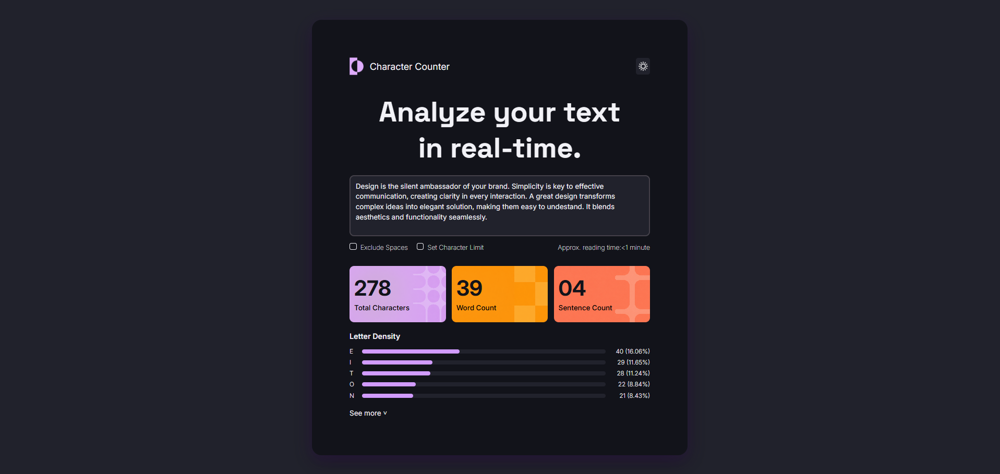
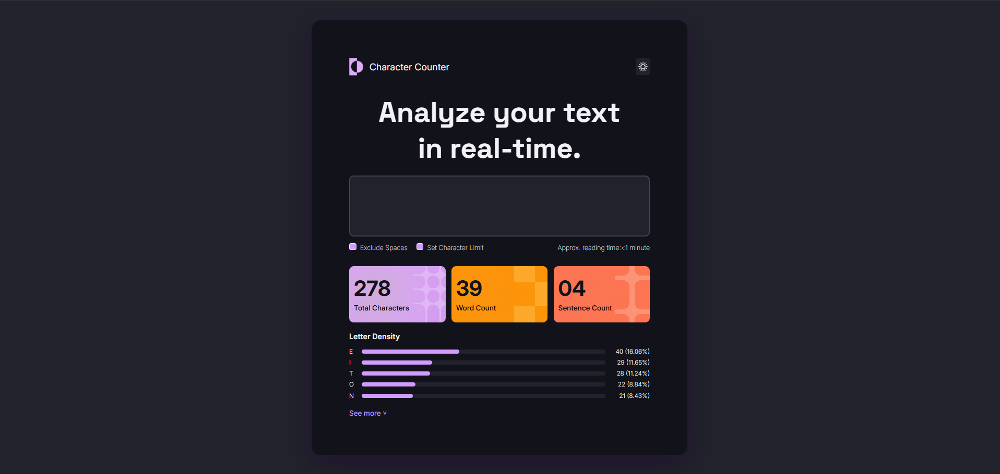

# Character Counter

## 1. Objetivo del proyecto
El objetivo de este proyecto fue armar y estilar una página web, dejándola visualmente terminada y lista para poder sumarle toda la funcionalidad con JavaScript el día de mañana.

## 2. Tecnologías utilizadas
* HTML
* CSS
* Git y GitHub

## 3. Organización del HTML:

En primer lugar, analicé el diseño y vi que no ocupaba toda la pantalla, así que decidí meter todo el contenido de la página adentro de una etiqueta `<main>`. Este funciona como mi "tarjeta" principal centrada en el medio.

Para organizar el contenido adentro del main, lo dividí en cuatro partes:
* Un `<header>` donde ubiqué el logo, el título y el botón del sol.
* Una `<section>` (que llamé "first-sect") donde puse el título principal, el `<textarea>` para escribir, y un div para los checkboxes y el tiempo de lectura.
* Una segunda `<section>` ("second-sect") para las tres tarjetitas de resultados. A cada tarjeta le di un div separado (`.card`, `.card2` y `.card3`).
* Una última `<section>` para la parte de Letter Density. Acá agrupé todo en un div llamado `.grupo-progress`. Elegí usar la etiqueta `<progress>` para hacer las barras. Cada letra, barra y porcentaje está agrupado en su propio div.

Las imágenes que usé las fui guardando bien ordenadas en una carpeta `assets/images`.

## 4. Resolución del CSS:

Arranqué haciendo el clásico reset de márgenes y paddings con el `*`, y después creé en el `:root` todas las variables que iba a necesitar para los colores y las tipografías (Inter y Space Grotesk).

Después pasé al `body`, donde usé Flexbox y `height: 100vh` para que el `<main>` me quede perfectamente centrado en la pantalla. Al main le di el color de fondo, le redondeé los bordes y le agregué un `box-shadow` sutil con el color violeta del diseño para darle profundidad.

Una vez que tuve la estructura base, fui estilando por partes:

**Header:**
Usé Flexbox (`justify-content: space-between`) para mandar el texto a la izquierda y el botón del sol a la derecha. Le saqué el borde al botón y lo acomodé.

**Text, Textarea y Checkboxes:**
Acomodé el título y después le saqué la apariencia por defecto al `<textarea>`. Le saqué el borde, lo dejé fijo para que no se pueda estirar (`resize: none`), y le cambié los colores y fuentes al `::placeholder`.
Para que la fila de checkboxes y el tiempo de lectura quedaran bien, usé `space-between`. La mayor dificultad acá fue darle estilo a los cuadraditos de los inputs. Lo resolví poniéndoles `appearance: none` para borrar el cuadradito feo de Windows, y usé la pseudo-clase `:checked` para que se pinten de violeta usando mi variable cuando los tocás.

**Cards de imágenes:**
A la sección que las envuelve le puse Flexbox para alinearlas. A cada div (`.card`, `.card2`, `.card3`.) le puse un ancho y alto fijo, y les agregué su fondo correspondiente usando `background-image` con la ruta de la imagen, centrando el contenido adentro.

**Barras progress:**
Esta fue otra de las partes difíciles. Para acomodar la letra, la barra y el porcentaje usé Flexbox con un `gap` de 15px. Para que los porcentajes me queden perfectamente alineados en una columna a la derecha, le di un ancho fijo al último párrafo y le puse `text-align: right`.
Para estilar el `<progress>`, tuve que resetearlo con `appearance: none` y usar `::-webkit-progress-bar` para el fondo gris y `::-webkit-progress-value` para la barrita violeta con bordes redondeados.

**Botón "See more":**
Por último, estilé el botón del final. Le saqué el fondo transparente y le agregué un efecto `:hover` para que el texto cambie a color violeta cuando pasás el mouse por encima. También lo hice Flexbox para que la flechita quede perfectamente alineada con el texto.

## 5. Dificultades encontradas

Lo que más me costó de todo el proyecto fue pelear contra los estilos predeterminados que el navegador le pone a algunas etiquetas, problema con la ruta de las imagenes y Git/GitHub:

* **Textarea y Checkboxes:** Tuve que buscarle la vuelta para sacarles el diseño rígido que traen de fábrica. Al `textarea` le tuve que borrar los bordes, bloquearlo para que el usuario no lo pueda estirar (`resize: none`), y aprender a darle estilo al texto temporal de fondo usando `::placeholder`. Con los checkboxes pasó lo mismo: tuve que "borrar" el cuadrado clásico de Windows usando `appearance: none` para poder crear mi propio cuadradito personalizado, y usar `:checked` para que se pinte de violeta al hacerle clic.
* **Barras de progreso:** Esto fue lo más complejo del CSS. Como decidí usar la etiqueta  `<progress>`, se me complico bastante para cambiarle los colores base. Aprendí que había que resetearla y usar selectores específicos (`::-webkit-progress-bar` y `::-webkit-progress-value`) para poder darle el fondo oscuro y el relleno violeta con los bordes redondeados.
* **Las rutas de las imágenes:** Cuando creí que estaba todo bien, abrí el archivo haciendo doble clic al index.html y las imágenes no me cargaban pero si cuando lo abria con el Live Server. Le pregunte a la IA y resulta que estaba usando rutas absolutas (con un `/` al principio). Lo terminé solucionando cambiando todo a rutas relativas, usando `./` en el HTML y en el archivo CSS para que el navegador tambien las tomara abriendo directamente el index.html.
* **El uso de Git y GitHub:** Como estoy arrancando a manejar la terminal se me complicaba acordarme de la secuencia  de los comandos (`git add`, `git commit`, `git push`). Me daba miedo equivocarme en los commits, me equivoque en algunos y ya los habia pusheado pero la IA me ayudo a arreglarlos. Me gusto bastante ir siguiendo el trabajo paso a paso e ir viendo los cambios que uno va haciendo.

## 6. Capturas del resultado final

